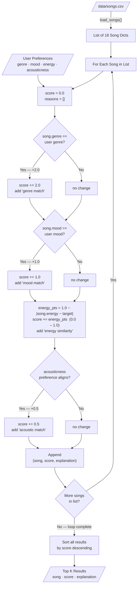

# Data Flow: Music Recommender Simulation

This diagram traces the path of a single song from the CSV catalog through the
scoring loop to its place in the final ranked output.

## Scoring weights at a glance

| Step | Signal | Points |
|------|--------|--------|
| 1 | Genre exact match | +2.0 |
| 2 | Mood exact match | +1.0 |
| 3 | Energy closeness | +0.0 – 1.0 |
| 4 | Acousticness preference | +0.5 |
| | **Max possible score** | **4.5** |

## How a single song moves through the system

1. `load_songs("data/songs.csv")` reads the file into a plain Python list of dicts.
2. `recommend_songs(user_prefs, songs, k)` iterates over every song.
3. Each song enters `_score_song_dict()`, collecting points at each of the four
   scoring steps; each step also appends a human-readable reason string.
4. The `(song, score, explanation)` tuple is stored in a results list.
5. After the loop, results are sorted by `score` descending.
6. The top `k` tuples are returned and printed by `main.py`.
